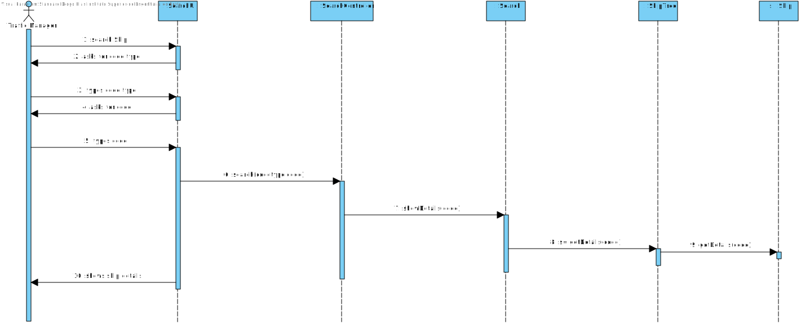
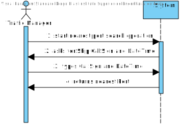
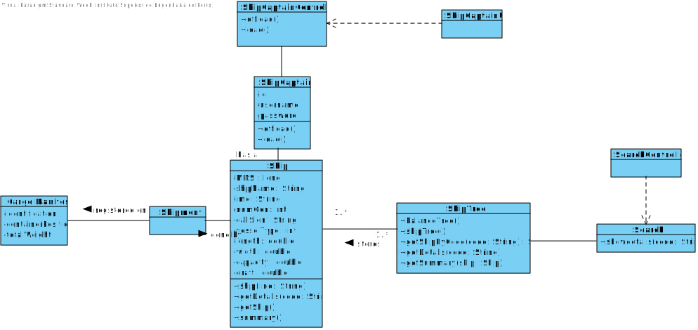
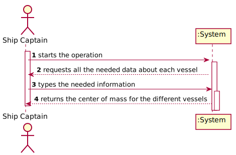
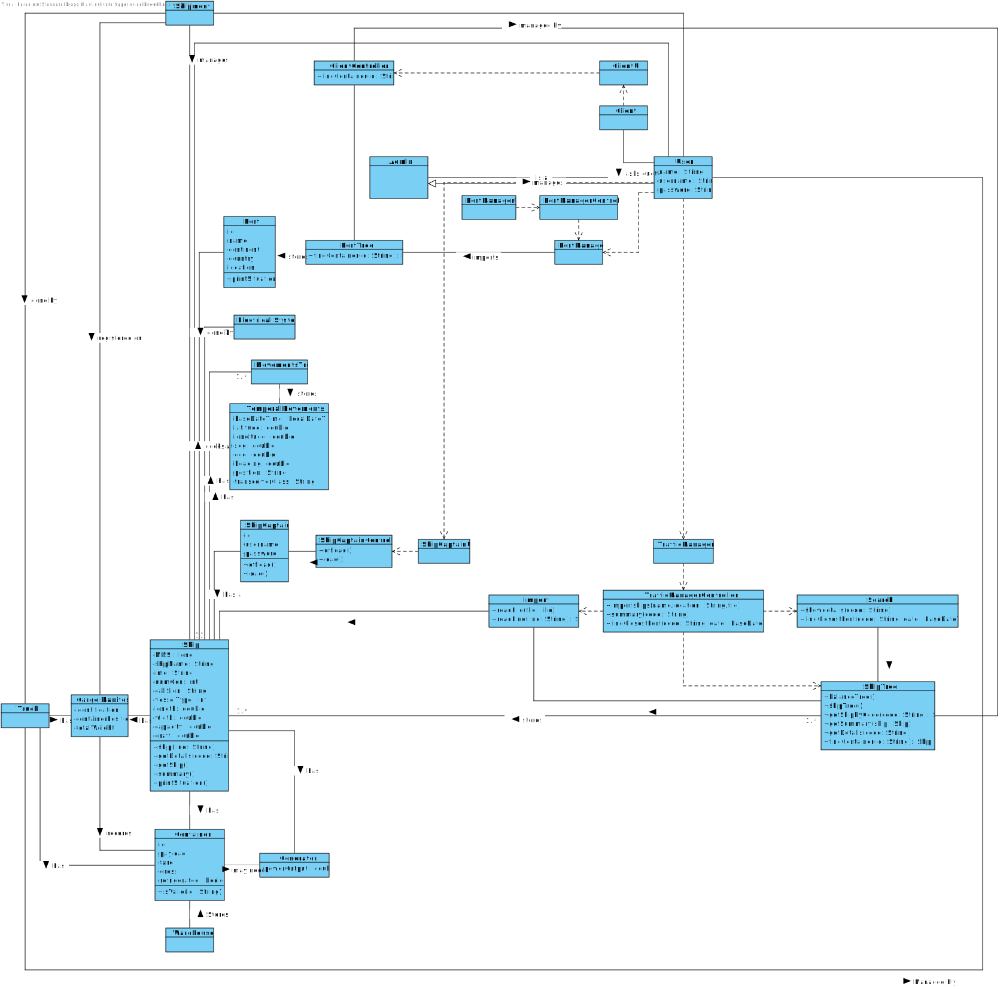

# G031 - Integrative Project Report

#Introduction
#Index
* Sprint 1 - From US101 to US110
* Sprint 2 - From US201 to US210

##US101
###Analysis


###Design


###Implementation

####Test Description

---
##US102
###Analysis


###Design


###Implementation

####Test Description

---

##US103
###Analysis

###Design

###Implementation

####Test Description
By the description provided by the client they will want to have this implemented:
* Access position Messages of ship given period of time or date 
    * Information Structure need to be well organized - Test!
    * Period must be valid - Test!
    * Date must be valid - Test!
    * If Ship has not moved - information must be provided - Test!
    * Output must be well-designed and in order - Test!
    * Messages need to be translated to position effectively - Test!
* Access to Ship Information
    * Assured by US101 Tests

---

##US201 <a name="us201"></a>
###Analysis


###Design


###Implementation

1. We will need to import the Ports from file
  1. We will need, for each Port, to verify its values in construction
  1. We will need to insert Port in Class and use Coordinates to Compare
1. We will need to add them to Database


####Test Description
Only information to be presented is success/not success - We need to text this output
  * Test if Ports where imported successfully!
      * Added to the Database.
  * Test if Ports where not imported!

We need to check if 2D-Tree is Balanced:
  * Test 2DTree Methods
    * Insert
    * Remove
    * Find
  

---

##US202 <a name="us202"></a>
###Analysis


###Design


###Implementation

####Test Description

---

##US204 <a name="us204"></a>
###Analysis


###Design


###Implementation

####Test Description

---

##US205 <a name="us205"></a>
###Analysis


###Design


###Implementation

####Test Description

---

##US206 <a name="us206"></a>
###Analysis


###Design


###Implementation

####Test Description

---

##US207 <a name="us207"></a>
###Analysis


###Design


###Implementation

####Test Description

---

##US208 <a name="us208"></a>
###Analysis


###Design


###Implementation

####Test Description

---

##US209 <a name="us209"></a>
###Analysis


###Design


###Implementation

####Test Description

---

##US210 <a name="us210"></a>
###Analysis


###Design


###Implementation

####Test Description

---

##US301
###Analysis


###Design


###Implementation

####Test Description

According to the AC we want to :
* Implement a Graph with the Vertices of Cities/Capitals and Ports.
    * This graph needs to use an adjacency matrix representation.
* The Edges of the graph represent the connection between the Cities and Ports
    * Each Capital is connected to the nearest Port of its Country
    * Each Capital also connects with the Capital of the Countries it borders.
    * Each Port connects to all Ports of the Same Country.
    * Each Port connects with n-Number of Ports Closest to it. N Being defined in the program.
    * All Edges are weighed and the weigh represents the distance between the to Places that are connected in KM's

We need to Test:
* If the graph has Ports and Capitals at the Same time.
* If the Capital is connected to the nearest Country Port
    * if the Capital doesn't connect to a neighbour Port
    * if the Capital can update the Port it connects when a new closest Port is added - ?
* If the Capital is connected with all Capitals of Country it borders and if is not connected with a Country it has no border with
* If a Port is connected with all the Ports of the Same Country 
    * If, when inserted, it connectes with all the Ports of a country.
* If has a connection with the n necessary ports
* if the weigh is well-placed

**Tests should be done to basic Structure and Replicated with the Objects needed!**

---

##US401 <a name="us401"></a>
###Analysis


###Design


###Implementation

To verify which ports have great centrality, I need to verify certain conditions:
* We need to create an algorithm that from a given graph can build the shortest path of them all (Floyd-Warshall)
* We need to get the N number of vertices that present the greater centrality (have bigger outgoing edges), which are Ports


####Test Description

* Verify if algorithm creates the shortest Path of all graph.
* Verify if i get the list with the vertices with greater centrality
* Verify that the vertices obtained are ports


---


##US402 <a name="us402"></a>
###Analysis


###Design


###Implementation

* It's necessary to verify if locals are in the graph.
* It's necessary to get the shortest path of graph - FloydWarshall
* After getting the shortest path - Verify if path goes only through ports (maritime), only through cities (land) or both.

####Test Description


##US418 <a name="us418"></a>
###Analysis


###Design


###Implementation

####Test Description

##US420 <a name="us420"></a>
###Analysis


###Design


###Implementation

####Test Description


---
##Domain Model


---

##Class Diagram



---
---
---
# README

This is the repository template used for student repositories in LAPR Projets.

## Java source files

Java source and test files are located in folder src.

## Maven file

Pom.xml file controls the project build.

### Notes
In this file, DO NOT EDIT the following elements:

* groupID
* artifactID
* version
* properties

Beside, students can only add dependencies to the specified section of this file.

## Eclipse files

The following files are solely used by Eclipse IDE:

* .classpath
* .project

## IntelliJ Idea IDE files

The following folder is solely used by Intellij Idea IDE :

* .idea

# How was the .gitignore file generated?
.gitignore file was generated based on https://www.gitignore.io/ with the following keywords:

  - Java
  - Maven
  - Eclipse
  - NetBeans
  - Intellij

# Who do I talk to?
In case you have any problem, please email Nuno Bettencourt (nmb@isep.ipp.pt).

# How do I use Maven?

## How to run unit tests?

Execute the "test" goals.

```shell
$ mvn test
```
## How to generate the javadoc for source code?

Execute the "javadoc:javadoc" goal.

```shell
$ mvn javadoc:javadoc
```
This generates the source code javadoc in folder "target/site/apidocs/index.html".

## How to generate the javadoc for test cases code?

Execute the "javadoc:test-javadoc" goal.

```shell
$ mvn javadoc:test-javadoc
```
This generates the test cases javadoc in folder "target/site/testapidocs/index.html".

## How to generate Jacoco's Code Coverage Report?

Execute the "jacoco:report" goal.

```shell
$ mvn test jacoco:report
```

This generates a jacoco code coverage report in folder "target/site/jacoco/index.html".

## How to generate PIT Mutation Code Coverage?

Execute the "org.pitest:pitest-maven:mutationCoverage" goal.

```shell
$ mvn test org.pitest:pitest-maven:mutationCoverage
```
This generates a PIT Mutation coverage report in folder "target/pit-reports/YYYYMMDDHHMI".

## How to combine different maven goals in one step?

You can combine different maven goals in the same command. For example, to locally run your project just like on jenkins, use:

```shell
$ mvn clean test jacoco:report org.pitest:pitest-maven:mutationCoverage
```
## How to perform a faster pit mutation analysis?

Do not clean build => remove "clean"

Reuse the previous report => add "-Dsonar.pitest.mode=reuseReport"

Use more threads to perform the analysis. The number is dependent on each computer CPU => add "-Dthreads=4"

Temporarily remove timestamps from reports.

Example:
```shell
$ mvn test jacoco:report org.pitest:pitest-maven:mutationCoverage -DhistoryInputFile=target/fasterPitMutationTesting-history.txt -DhistoryOutputFile=target/fasterPitMutationTesting-history.txt -Dsonar.pitest.mode=reuseReport -Dthreads=4 -DtimestampedReports=false
```
## Where do I configure my database connection?

Each group should configure their database connection on the file:
* src/main/resources/application.properties