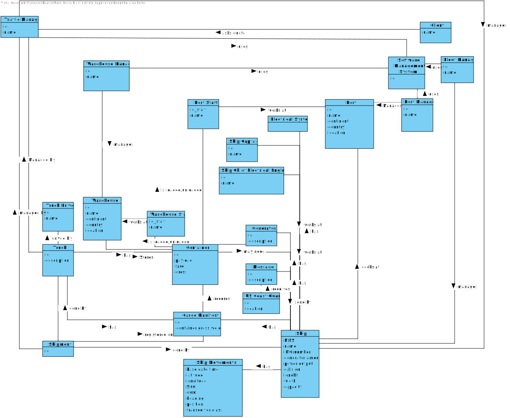

# Domain Model

## Rationale to identify domain conceptual classes ##
To identify domain conceptual classes, start by making a list of candidate conceptual classes inspired by the list of categories suggested in the book "Applying UML and Patterns: An Introduction to Object-Oriented Analysis and Design and Iterative Development". 

### _Conceptual Class Category List_ ###

| **Category** 		|  **Candidate Classes** |
|------------  				|---------      |
| **Business Transactions** 	| Shipment|
|**Transaction Line Items**| Container(s), Message(s) |
|**Product/Service related to a Transaction or Transaction Line Item**|Ship(s), Truck(s),Generator(s) |
|**Transaction Records**| Cargo Manifest |
|**Roles of People or Organizations**|US Coast Guard, Traffic Manager , Client, Fleet Manager, Warehouse Staff, Warehouse Manager, Port Staff, Port Manager, Ship Captain, Ship Chief Electrical Engineer, Truck Driver|
|**Places**|Warehouse(s), Port(s)|
|**Noteworthy Events**|Loading, Unloading, Transport|
|**Physical Objects**| |
|**Descriptions of Things**| |
|**Organizations**||
|**Other External/Collaborating Systems**| Electrical System|
|**Records of finance, work, contracts, legal matters**|Software system|
|**Documents mentioned/used to perform some work**| |

### **Rationale to identify associations between conceptual classes**

| Concept (A) 		|  Association   	|  Concept (B) |
|----------	   		|:-------------:		|------:       |
|Shipment | done by| Ship|
|Shipment | done by | Truck|
|Shipment | needs | Cargo Manifest|
|Shipment | managed by | Traffic Manager|
|Container| can be on | Ship|
|Container| can be on | Truck|
|Container| can be on | Warehouse|
|Container| can be on | Port|
|Container| may need | Generator|
|Container| loaded/unloaded by | Warehouse Staff, Port Staff|
|Message | send by | Ship|
|Message | send to | US Coast Guard|
|Message | contains | Transport Information|
|Ship| has a | Ship Captain|
|Ship | has a | Electrical Engineer|
|Ship| may have | Generators|
|Ship| sends |Messages|
|Ship| does | Shipment|
|Ship|has a | Cargo Manifest|
|Ship | is managed by | Traffic Manager|
|Ship | docks at| Ports|
|Ship| does|Loading/Unloading|
|Ship | has an| Electrical System|
|Truck| does| Shipment|
|Truck| can have|Container|
|Truck| has a | Cargo Manifest|
|Truck| drive by | Truck Driver |
|Truck | Controlled by| Traffic Manager
|Truck| does | Transport|
|Generator| is on | Ship|
|Generator | powers | container|
|Cargo Manifest| has | Shipment Information|
|Cargo Manifest | is owned by | Ship|
|Cargo Manifest | is owned by | Truck|
|Cargo Manifest | is given to | Warehouse Manager|
|Cargo Manifest | is given to | Port Manager|
|Cargo Manifest | registers | Loading/Unloading|
|US Coast Guard | receives | Message|
|...|...|...

## Domain Model

