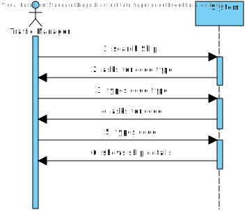
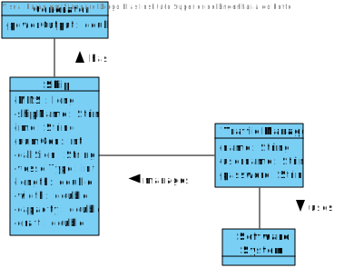
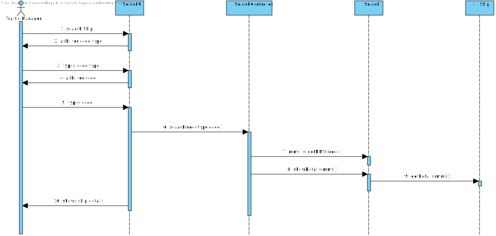

# US102 - Search Ships By Code

# Analysis

*This section of the document express the work done in the Analysis part of the US.*

### 1. User Story Description

*As a traffic manager I which to search the details of a ship using any of its codes: MMSI, IMO or Call Sign.*

### 2. Customer Specifications and Clarifications 

Traffic Manager logs and wants to search details of ship. 3 options of search are given MMSI, IMO or Call Sign - Unique attributes.

Client hasn't answered yet information to be displayed.

Codes have specific rules, except call sign - Question asked - Call Sign length

**As a future feature**, the necessity of asking Traffic Manager to select the code can be ommited because this codes have specific length and Business model rules.

### 3. Acceptance Criteria

AC(ESINF):
* correct use of OOP concepts - HC+LC - Information can be accessed by the correct classes

### 4. Found out Dependencies

We need the ships to be logged in the Application, so this US depends on the correct implementations of US101.

### 5 Input and Output Data

####Input:
* Choice of code to Search (MMSI,IMO or Code Sign)
* Code

####Output:
* Ship Details

### 6. System Sequence Diagram (SSD)

*Insert here a SSD depicting the envisioned Actor-System interactions and throughout which data is inputted and outputted to fulfill the requirement. All interactions must be numbered.*

### 7. Relevant Domain Model Excerpt 
*In this section, it is suggested to present an excerpt of the domain model that is seen as relevant to fulfill this requirement.* 

### 8. Other Remarks

*Use this section to capture some aditional notes/remarks that must be taken into consideration into the design activity. In some case, it might be usefull to add other analysis artifacts (e.g. activity or state diagrams).* 

The information given by the Client suggest we need to have the info Stored or structure in 3 different BST.

## Design 

### 1. Rationale (optional)

**The rationale grounds on the SSD interactions and the identified input/output data.**

| Interaction ID | Question: Which class is responsible for... | Answer  | Justification (with patterns)  |
|:-------------  |:--------------------- |:------------|:---------------------------- |
| Step 1 - search ship 		 |			interact with the user?				 |     SearchUI        |  Bridge between System and User                            |
| Step 2 - asks for code type 		 |	ask for information?						 |    SearchUI         |  Class that interacts with the user                            |
| Step 3 - types code type 		 |		stores information typed?					 |    SearchController - local variable        |     Interacts with System and manages all operation                         |
| Step 4 - asks for code 		 |		ask for information?					 |     SearchController        |   Class that interacts with UI                           |
| Step 5 - types code 		 |		stores information typed?					 |     SearchController        |                              |
| Step 5 - types code 		 |		searchs info?					 |     Search        |    Maintain class information                      |
| Step 5 - types code 		 |		compares info?					 |     Ship        |     IE:Knows information                          |
| Step 6 - shows ship details 		 |	show Ship Details?						 |   SearchController          |      Interact between UI and System                        |              

#### 1.1 Systematization 

According to the taken rationale, the conceptual classes promoted to software classes are: 

 * Search
 * Ship

Other software classes (i.e. Pure Fabrication) identified: 
 * SearchUI  
 * SearchController

### 2. Sequence Diagram (SD)

*In this section, it is suggested to present an UML dynamic view stating the sequence of domain related software objects' interactions that allows to fulfill the requirement.* 

### 3. Class Diagram (CD)

*In this section, it is suggested to present an UML static view representing the main domain related software classes that are involved in fulfilling the requirement as well as and their relations, attributes and methods.*

### 4. Observations

*In this section, it is suggested to present a critical perspective on the developed work, pointing, for example, to other alternatives and or future related work.*

