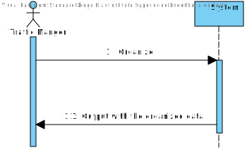
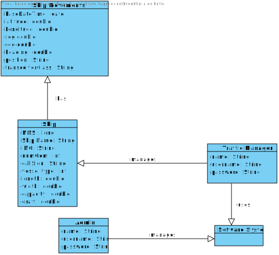
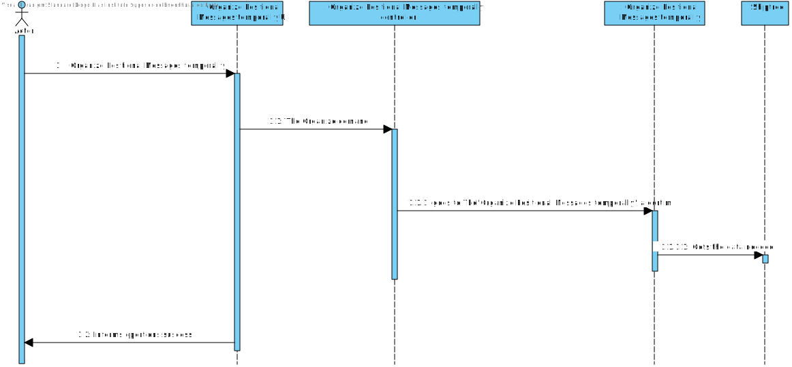
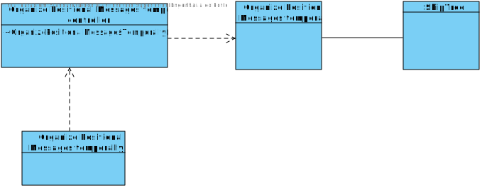

# US103 - Organize Positional Messages temporally and associated ships

# Analysis

*This section of the document express the work done in the Analysis part of the US.*

### 1. User Story Description  

*As a traffic manager I witch to have the positional messages temporally organized and associated with each of the ships*

### 2. Customer Specifications and Clarifications

In this Us the client wants a comand for the trafic manager where he can organize the positional messages arcoding to the base date time and associate whith each of the ships

Access to Application - Client does not have idea yet - Maybe Email/User Name and password.

### 3. Acceptance Criteria

AC(ESINF):
* efficient access of any position value(s) of a ship on a period or date.

### 4. Found out Dependencies

No dependencies found.

### 5 Input and Output Data

None

### 6. System Sequence Diagram (SSD)

### 7. Relevant Domain Model Excerpt

### 8. Other Remarks
*Use this section to capture some aditional notes/remarks that must be taken into consideration into the design activity. In some case, it might be usefull to add other analysis artifacts (e.g. activity or state diagrams).*

## Design

### 1. Rationale (optional)

#### 1.1 Systematization

### 2. Sequence Diagram (SD)

####Additional

### 3. Class Diagram

### 4. Observations

*In this section, it is suggested to present a critical perspective on the developed work, pointing, for example, to other alternatives and or future related work.*
