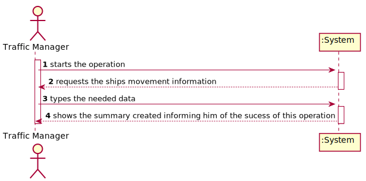
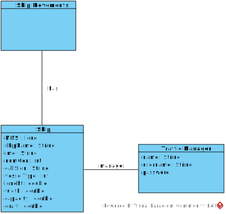

# US104 - 

# Analysis

*This section of the document express the work done in the Analysis part of the US.*

### 1. User Story Description

*Insert here the User Story as described by the client.*

### 2. Customer Specifications and Clarifications 

*Insert here any related specification and/or clarification provided by the client together with **your interpretation**. When possible, provide a link to such specifications/clarifications.*

### 3. Acceptance Criteria

*Insert here the client acceptance criteria.*

### 4. Found out Dependencies

*Identify here any found out dependency to other US and/or requirements.*

### 5 Input and Output Data

*Identity here the data to be inputted by the system actor as well as the output data that the system have/needs to present in order to properly support the actor actions. Regarding the inputted data, it is suggested to distinguish between typed data and selected data (e.g. from a list)*

### 6. System Sequence Diagram (SSD)

*Insert here a SSD depicting the envisioned Actor-System interactions and throughout which data is inputted and outputted to fulfill the requirement. All interactions must be numbered.*

### 7. Relevant Domain Model Excerpt 
*In this section, it is suggested to present an excerpt of the domain model that is seen as relevant to fulfill this requirement.* 

### 8. Other Remarks

*Use this section to capture some aditional notes/remarks that must be taken into consideration into the design activity. In some case, it might be usefull to add other analysis artifacts (e.g. activity or state diagrams).* 

## Design 

### 1. Rationale (optional)

**The rationale grounds on the SSD interactions and the identified input/output data.**

| Interaction ID | Question: Which class is responsible for... | Answer  | Justification (with patterns)  |
|:-------------  |:--------------------- |:------------|:---------------------------- |
| Step 1 - starts the operation  		 |			Interact with USER?				 |    SummaryUI         |                              |
| Step 2 - requests the ship movement information 		 |		ask for information?					 |   SummaryUI          |                              |
| Step 3 - types the needed data 		 |			receives data input?				 |    SummaryController         |    Bridges between System and UI                          |
| Step 4 - validates and shows the summary created with that information, asking for confirmation 		 |			searching information? 				 | ShipTree            | IE:  has information regarding Ships                           |
| Step 4 - validates and shows the summary created with that information, asking for confirmation 		 |			showing information? 				 | SummaryController -> Ship            | IE:  has information regarding Ships                           |
| Step 5 - confirms 		 |							 |             |                              |
| Step 6 - informs him of the success of this operation 		 |							 |             |                              |              

#### 1.1 Systematization 

According to the taken rationale, the conceptual classes promoted to software classes are: 

 * ShipTree
 * Ship
 

Other software classes (i.e. Pure Fabrication) identified: 
 * SummaryUI  
 * SummaryController

### 2. Sequence Diagram (SD)

*In this section, it is suggested to present an UML dynamic view stating the sequence of domain related software objects' interactions that allows to fulfill the requirement.* 

### 3. Class Diagram (CD)

*In this section, it is suggested to present an UML static view representing the main domain related software classes that are involved in fulfilling the requirement as well as and their relations, attributes and methods.*

### 4. Observations

*In this section, it is suggested to present a critical perspective on the developed work, pointing, for example, to other alternatives and or future related work.*

