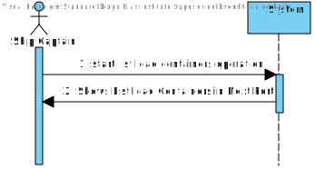

# US 206 - List Containers to be loaded - w/ Specification

# Analysis

*This section of the document express the work done in the Analysis part of the US.*

### 1. User Story Description

*As Ship Captain, I want the list of containers to be loaded in the next port,
including container identifier, type, and load.*

### 2. Customer Specifications and Clarifications 

Ship Captain is connected to a Specific Ship. 

Client Still needs to answer some questions

### 3. Acceptance Criteria

AC:
* “next port” is properly identified - Must Return a Port.
* The containers being loaded are properly identified - The Cargo Manifest from the Ship to the next Port.
* Output is in accordance with the specification wrt the information about each container. 

### 4. Found out Dependencies

US101 needs to be Implemented - Ships most be imported

US201 - Needs to be Implemented - Ports most be imported.

### 5 Input and Output Data

Input :
*
Output:
* List of Containers with Specification

### 6. System Sequence Diagram (SSD)

*Insert here a SSD depicting the envisioned Actor-System interactions and throughout which data is inputted and outputted to fulfill the requirement. All interactions must be numbered.*

### 7. Relevant Domain Model Excerpt 
*In this section, it is suggested to present an excerpt of the domain model that is seen as relevant to fulfill this requirement.* 

### 8. Other Remarks

*Use this section to capture some aditional notes/remarks that must be taken into consideration into the design activity. In some case, it might be usefull to add other analysis artifacts (e.g. activity or state diagrams).* 

## Design 

### 1. Rationale (optional)

**The rationale grounds on the SSD interactions and the identified input/output data.**

| Interaction ID | Question: Which class is responsible for... | Answer  | Justification (with patterns)  |
|:-------------  |:--------------------- |:------------|:---------------------------- |
| Step 1 - Start List load Containers Operation 		 |		Interacting with Ship Captain?					 |     ShipCaptainUI        |     PureFabrication                         |
| Step 1 - Start List load Containers Operation 		 |		Bridge between UI and System?					 |     ShipCaptainController        |     PureFabrication                         |
| Step 1 - Start List load Containers Operation 		 |		Knows current Ship Location?					 |    Database->MovementsTree         |      IE                        |
| Step 1 - Start List load Containers Operation 		 |		Calculates next port Location?					 |    ShipCaptain->PortStore->Port         |          IE                    |
| Step 1 - Start List load Containers Operation 		 |		Know Containers to be loaded?					 |    ??? Database->Ship->Cargo Manifest or Database->PortManager->Cargo Manifest         |       IE                       |
| Step 1 - Start List load Containers Operation 		 |		get Containers Information?					 |     Container        |       IE                       |
| Step 2 - Shows List load Containers in Next Port 		 |	Give Information of Containers?						 |      ??? Cargo Manifest->Container       |       IE                       |
| Step 2 - Shows List load Containers in Next Port 		 |	Show/Print information?						 |      ShipCaptainController->ShipCaptain->Container       |           HC+LC                   |

#### 1.1 Systematization 

According to the taken rationale, the conceptual classes promoted to software classes are: 

 * MovementsTree
 * ShipCaptain
 * PortStore
* Port
* Cargo Manifest
* Container

Other software classes (i.e. Pure Fabrication) identified: 
 * ShipCaptainUI  
 * ShipCaptainController

### 2. Sequence Diagram (SD)

*In this section, it is suggested to present an UML dynamic view stating the sequence of domain related software objects' interactions that allows to fulfill the requirement.* 

### 3. Class Diagram (CD)

*In this section, it is suggested to present an UML static view representing the main domain related software classes that are involved in fulfilling the requirement as well as and their relations, attributes and methods.*

### 4. Observations

*In this section, it is suggested to present a critical perspective on the developed work, pointing, for example, to other alternatives and or future related work.*

