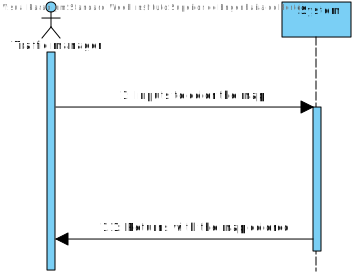
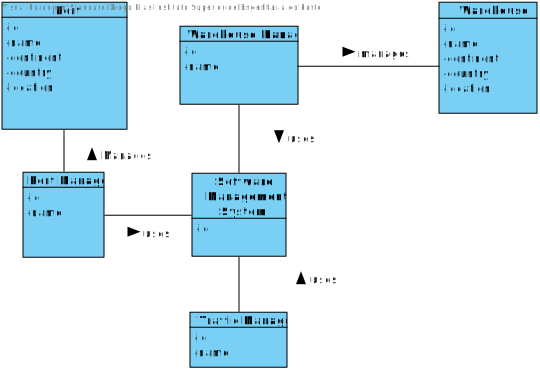
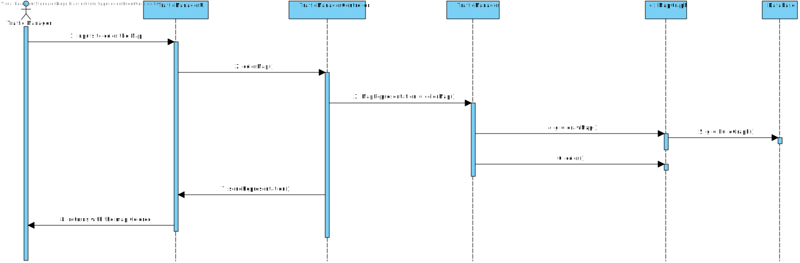

#US302 - Coloring the map with the fewest colors possible

#Analysis

*This section of the document express the work done in the Analysis part of the US.*

### 1. User Story Description

*As a Traffic manager I wish to colour the map using as few colours as possible.*

### 2. Customer Specifications and Clarifications

- Colours are meant to be a representation. This means that the objective of this US is to map a representation of a Map - Text or other - where the neighbouring countries are mapped with different tokens - colours or numbers - using the fewest of these later items as possible

### 3. Acceptance Criteria

AC:
* Neighbouring countries must not share the same colour.

### 4. Found out Dependencies

US301 - Graph needs to be created

### 5 Input and Output Data

Input :

* From Actor use operation color map

Output:

* The colored map

### 6. System Sequence Diagram (SSD)

*Insert here a SSD depicting the envisioned Actor-System interactions and throughout which data is inputted and outputted to fulfill the requirement. All interactions must be numbered.*

### 7. Relevant Domain Model Excerpt
*In this section, it is suggested to present an excerpt of the domain model that is seen as relevant to fulfill this requirement.*

### 8. Other Remarks

*Use this section to capture some aditional notes/remarks that must be taken into consideration into the design activity. In some case, it might be usefull to add other analysis artifacts (e.g. activity or state diagrams).*

## Design

### 1. Rationale (optional)

**The rationale grounds on the SSD interactions and the identified input/output data.**

| Interaction ID | Question: Which class is responsible for... | Answer  | Justification (with patterns)  |
|:-------------  |:--------------------- |:------------|:---------------------------- |
| Step 1 - inputs to color the Map 		 |		Interact with Actor?					 |    TrafficManagerUI         |                              |
| Step 1 - inputs to color the Map 		 |		Bridge between Actor and System?					 |   TrafficManagerController          |                              |
| Step 1 - inputs to color the Map 		 |		create graph?					 |                   TrafficManager->MapGraph                      |
| Step 1 - inputs to color the Map 		 |		color the graph?					 |                     MapGraph                      |
| Step 2 - returns with the map Colored 		 |			present the colored map?				 |      TrafficManagerController       |                              |

#### 1.1 Systematization

According to the taken rationale, the conceptual classes promoted to software classes are:

 * TrafficManager
 * MapGraph

Other software classes (i.e. Pure Fabrication) identified:
 * TrafficManagerUI
 * TrafficManagerController

### 2. Sequence Diagram (SD)

*In this section, it is suggested to present an UML dynamic view stating the sequence of domain related software objects' interactions that allows to fulfill the requirement.*

### 3. Class Diagram (CD)

*In this section, it is suggested to present an UML static view representing the main domain related software classes that are involved in fulfilling the requirement as well as and their relations, attributes and methods.*

### 4. Observations

*In this section, it is suggested to present a critical perspective on the developed work, pointing, for example, to other alternatives and or future related work.*
