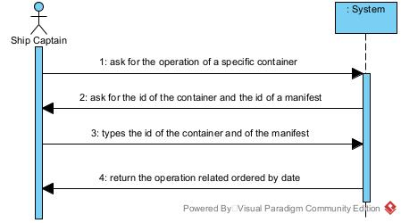
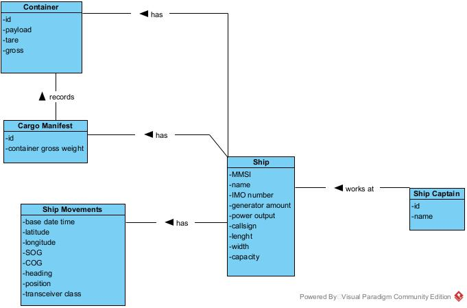

# US 304 - As Ship Captain, I want to have access to audit trails for a given container of a given cargo manifest, that is, I want to have access to a list of all operations performed on a given container of a given manifest, in chronological order. 

# Analysis

*This section of the document express the work done in the Analysis part of the US.*

### 1. User Story Description

*As Ship Captain, I want to have access to audit trails for a given container of a given cargo manifest, that is, I want to have access to a list of all operations performed on a given container of a given manifest, in chronological order. For each operation I want to know: the user/login that performed it, the date and time the operation was performed, the type of operation (INSERT, UPDATE, DELETE), the container identifier and the cargo manifest identifier.*

### 2. Customer Specifications and Clarifications 

Ship Captain provides the container id and a cargo manifest id and then its shown the operation related.

### 3. Acceptance Criteria

AC[BDBAD]:
* There is a table for recording audit trails, i.e., record all write-operations involving containers of a cargo manifest.
* Proper mechanisms for recording write-operations involving containers of a cargo manifest are implemented (INSERT, UPDATE, DELETE).
* A simple and effective audit trail consultation process is implemented.

### 4. Found out Dependencies
Entaty - Audit Trail created

Information about the operation needs to be given by ship captain a contianer_id and a manifest_id

### 5 Input and Output Data

Input :
* Ship Captain - container_id, manifest_id

Output:
* operations made

### 6. System Sequence Diagram (SSD)

*Insert here a SSD depicting the envisioned Actor-System interactions and throughout which data is inputted and outputted to fulfill the requirement. All interactions must be numbered.*

### 7. Relevant Domain Model Excerpt 
*In this section, it is suggested to present an excerpt of the domain model that is seen as relevant to fulfill this requirement.* 

### 8. Other Remarks

*Use this section to capture some aditional notes/remarks that must be taken into consideration into the design activity. In some case, it might be usefull to add other analysis artifacts (e.g. activity or state diagrams).* 

## Design 

### 1. Rationale (optional)

**The rationale grounds on the SSD interactions and the identified input/output data.**

#### 1.1 Systematization 

According to the taken rationale, the conceptual classes promoted to software classes are: 

Other software classes (i.e. Pure Fabrication) identified: 
 * ShipCaptainUI  
 * ShipCaptainController

### 2. Sequence Diagram (SD)

*In this section, it is suggested to present an UML dynamic view stating the sequence of domain related software objects' interactions that allows to fulfill the requirement.* 

### 3. Class Diagram (CD)

*In this section, it is suggested to present an UML static view representing the main domain related software classes that are involved in fulfilling the requirement as well as and their relations, attributes and methods.*

### 4. Observations

*In this section, it is suggested to present a critical perspective on the developed work, pointing, for example, to other alternatives and or future related work.*

