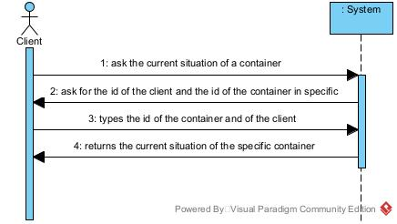

# US 312 - Show the current situation of a specific container 

# Analysis

*This section of the document express the work done in the Analysis part of the US.*

### 1. User Story Description

*As Client, I want to know the current situation of a specific container being used
to transport my goods*

### 2. Customer Specifications and Clarifications 

Clients provide the container identifier and the id of the client and get the type and the concrete
instance of its current location, e.g., PORT, Leixões or SHIP, WeFly or get an error if the container doesn't exist or the container is not leased by a client.

### 3. Acceptance Criteria

AC[BDBAD]:
* When the provided identifier is not valid or, being valid, is not leased by
the client, a warning is returned. This warning has two elements, the
error code and the identifier of the container. The error code will be: 10
– invalid container id or 11 – container is not leased by client.

### 4. Found out Dependencies
US204 - use the previous us

Information about container needs to be given by client and is own id

### 5 Input and Output Data

Input :
* Client - containerID, client_id

Output:
* current situation of a specific container

### 6. System Sequence Diagram (SSD)

*Insert here a SSD depicting the envisioned Actor-System interactions and throughout which data is inputted and outputted to fulfill the requirement. All interactions must be numbered.*

### 7. Relevant Domain Model Excerpt 
*In this section, it is suggested to present an excerpt of the domain model that is seen as relevant to fulfill this requirement.* 

### 8. Other Remarks

*Use this section to capture some aditional notes/remarks that must be taken into consideration into the design activity. In some case, it might be usefull to add other analysis artifacts (e.g. activity or state diagrams).* 

## Design 

### 1. Rationale (optional)

**The rationale grounds on the SSD interactions and the identified input/output data.**

| Interaction ID | Question: Which class is responsible for... | Answer  | Justification (with patterns)  |
|:-------------  |:--------------------- |:------------|:---------------------------- |
| Step 1 - ask the current situation of a container 		 |		Bridge between User and System?					 |   ClientUI          |      Pure Fabrication                        |
| Step 1 - ask the current situation of a container 		 |		store locally information to be used?					 |  ClientController           |    Pure Fabrication                           |
| Step 2 - ask for the id of the container in specific 		 |		ask info from the User?					 |    ClientController         |      HC+LC                        |
| Step 3 - types the id of the container 		 |		verify if Id is valid?					 |    Container         |    IE:Knows Details of Container                          |
| Step 3 - types the id of the container 		 |		verify if Database contains ID?					 |            |                              |
| Step 3.1 - types the id of the container 		 |		verify if ShipTree contains ID?					 |   ShipTree -> Ship         |     Store                         |
| Step 3.2 - types the id of the container 		 |		verify if TrucksStorage contains ID?					 |   PortStore -> Port           |    Store                          |
| Step 4 - returns the current situation of the specific container 		 |		show information required?					 |    Container         |   IE                           |

#### 1.1 Systematization 

According to the taken rationale, the conceptual classes promoted to software classes are: 

 * Container
 * ShipTree
 * Port
* PortStore
* Ship

Other software classes (i.e. Pure Fabrication) identified: 
 * ClientUI  
 * ClientController

### 2. Sequence Diagram (SD)

*In this section, it is suggested to present an UML dynamic view stating the sequence of domain related software objects' interactions that allows to fulfill the requirement.* 

### 3. Class Diagram (CD)

*In this section, it is suggested to present an UML static view representing the main domain related software classes that are involved in fulfilling the requirement as well as and their relations, attributes and methods.*

### 4. Observations

*In this section, it is suggested to present a critical perspective on the developed work, pointing, for example, to other alternatives and or future related work.*

