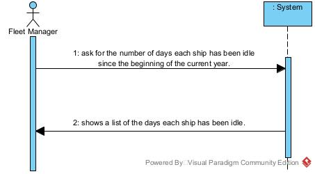
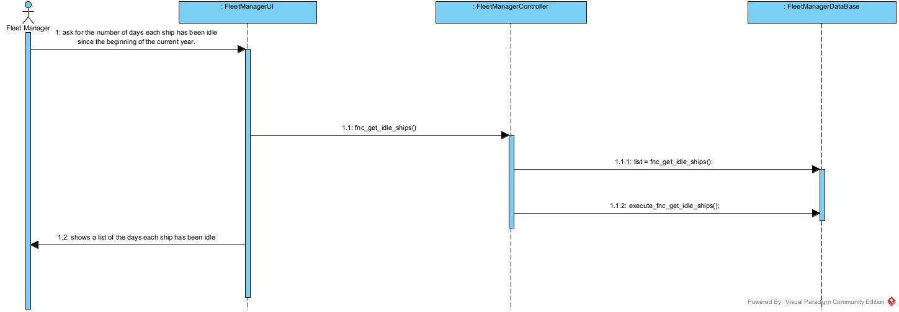
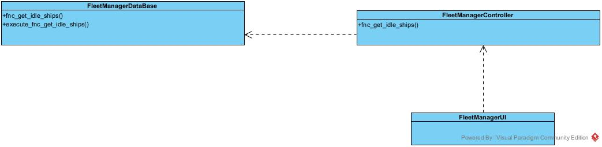

# US404 - Know days each ship has been idle

# Analysis

*This section of the document express the work done in the Analysis part of the US.*

### 1. User Story Description

* ] As Fleet Manager, I want to know the number of days each ship has been idle since the beginning of the current year.*

### 2. Customer Specifications and Clarifications 

### 3. Acceptance Criteria

AC:
* Current year is properly identified.
* Idle time is correctly computed per ship.
* Ships with no idle time are also reported.

### 4. Found out Dependencies

Needs the data base ready.

### 5 Input and Output Data

####Input:
* None

####Output:
* list of the days each ship has been idle since the beggining of the current year

### 6. System Sequence Diagram (SSD)

*Insert here a SSD depicting the envisioned Actor-System interactions and throughout which data is inputted and outputted to fulfill the requirement. All interactions must be numbered.*

### 7. Relevant Domain Model Excerpt 
*In this section, it is suggested to present an excerpt of the domain model that is seen as relevant to fulfill this requirement.* 

### 8. Other Remarks

*Use this section to capture some aditional notes/remarks that must be taken into consideration into the design activity. In some case, it might be usefull to add other analysis artifacts (e.g. activity or state diagrams).* 

## Design 

### 1. Rationale (optional)

**The rationale grounds on the SSD interactions and the identified input/output data.**

| Interaction ID | Question: Which class is responsible for... | Answer  | Justification (with patterns)  |
|:-------------  |:--------------------- |:------------|:---------------------------- |
| 	 |						 |             |                             |
|  		 |				 |             |                             |

#### 1.1 Systematization 

According to the taken rationale, the conceptual classes promoted to software classes are: 

 * 

Other software classes (i.e. Pure Fabrication) identified: 
 * FleetManagerUI  

### 2. Sequence Diagram (SD)

*In this section, it is suggested to present an UML dynamic view stating the sequence of domain related software objects' interactions that allows to fulfill the requirement.* 

### 3. Class Diagram (CD)

*In this section, it is suggested to present an UML static view representing the main domain related software classes that are involved in fulfilling the requirement as well as and their relations, attributes and methods.*

### 4. Observations

*In this section, it is suggested to present a critical perspective on the developed work, pointing, for example, to other alternatives and or future related work.*

