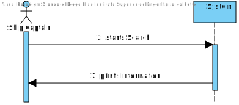
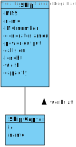
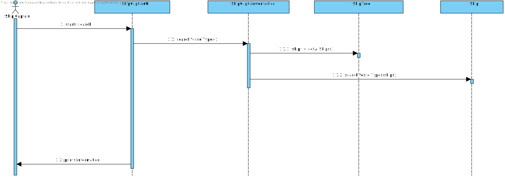
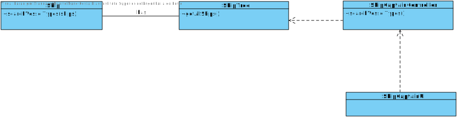

# US417 - Search for different types of vessels and their characteristics

# Analysis

*This section of the document express the work done in the Analysis part of the US.*

### 1. User Story Description

*As the Ship Captain I want the technical team to search for at least three types of
  ship/vessels that are better suited to the task (e.g., depending on the type of cargo), in
  which the “control” bridge can assume three positions, one in the bow, one in the stern,
  and finally in the midship.*

### 2. Customer Specifications and Clarifications 

...

### 3. Acceptance Criteria

AC(LAPR3):
* Search the different types of vessels for transporting different types of cargo. Containers, or solids in bulk.

* Identify the differentiating characteristics.

### 4. Found out Dependencies

Information about vessels need to be on the APP

### 5 Input and Output Data

####Input:
* None

####Output:
* Information about vessel types and their differences 

### 6. System Sequence Diagram (SSD)

*Insert here a SSD depicting the envisioned Actor-System interactions and throughout which data is inputted and outputted to fulfill the requirement. All interactions must be numbered.*

### 7. Relevant Domain Model Excerpt 
*In this section, it is suggested to present an excerpt of the domain model that is seen as relevant to fulfill this requirement.* 

### 8. Other Remarks

*Use this section to capture some aditional notes/remarks that must be taken into consideration into the design activity. In some case, it might be usefull to add other analysis artifacts (e.g. activity or state diagrams).* 

## Design 

### 1. Rationale (optional)

**The rationale grounds on the SSD interactions and the identified input/output data.**

| Interaction ID | Question: Which class is responsible for... | Answer  | Justification (with patterns)  |
|:-------------  |:--------------------- |:------------|:---------------------------- |
| 	 |						 |             |                             |
|  		 |				 |             |                             |

#### 1.1 Systematization 

According to the taken rationale, the conceptual classes promoted to software classes are: 

 * 

Other software classes (i.e. Pure Fabrication) identified: 
 * XXXUI  
 * 

### 2. Sequence Diagram (SD)

*In this section, it is suggested to present an UML dynamic view stating the sequence of domain related software objects' interactions that allows to fulfill the requirement.* 

### 3. Class Diagram (CD)

*In this section, it is suggested to present an UML static view representing the main domain related software classes that are involved in fulfilling the requirement as well as and their relations, attributes and methods.*

### 4. Observations

*In this section, it is suggested to present a critical perspective on the developed work, pointing, for example, to other alternatives and or future related work.*

